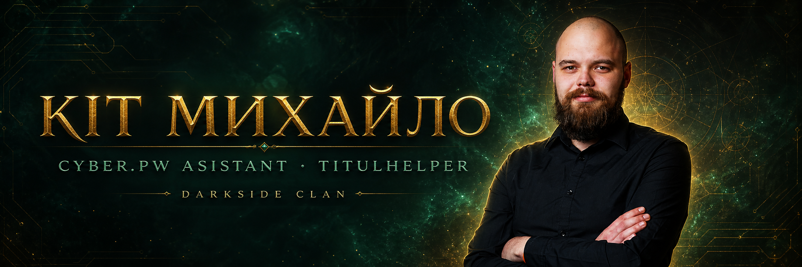

<p align="center"></p>
<h1 align="center">CyberPW Assistant</h1>
<p align="center">Неофіційний відкритий інструментарій для гравців CyberPW<br><strong>2.0 Beta · C# / .NET Framework · Windows 7/10/11 x64 · Portable</strong></p>
<p align="center"><a href="https://github.com/vitalikjukivskiy/titul_helper-2.0/releases"></a> <a href="https://github.com/vitalikjukivskiy/titul_helper-2.0/releases"></a></p>
<p align="center"><a href="https://cyberpw.fun/">Сайт</a> · <a href="https://forum.cyberpw.fun/index.php?threads/titulhelper-1-0.271/">Тема на форумі</a> · <a href="https://cabinet.cyberpw.fun/">Кабінет</a> · <a href="https://cabinet.cyberpw.fun/register.php?ref=4550">Реєстрація з бонусом</a> · <a href="https://www.youtube.com/@Vitalik_Juk">YouTube</a> · <a href="https://send.monobank.ua/jar/93N5FBB3zX">Підтримати</a></p>

> [!IMPORTANT]
> Це неофіційний фанатський проєкт. Перед використанням макросів перевірте правила сервера. Синхронізація TitulHelper лише читає ID отриманих титулів із підтримуваної збірки клієнта та нічого в грі не змінює.

> [!WARNING]
> **2.0 має статус Beta.** Лаунчер повністю переписаний з PowerShell на C# WinForms/.NET Framework для швидшого запуску, миттєвого перемикання модулів і стабільнішого системного вводу. Через відмінності Windows, DPI, прав доступу та збірок ElementClient окремі функції можуть працювати не на всіх ПК.

## Що входить

### TitulHelper

- база 260 точок запуску титулів у 37 ланцюжках;
- пошук, прогрес, відкриття списку титулів і введення координат мітки;
- синхронізація отриманих титулів одним натисканням без OCR;
- перевірка SHA256 клієнта: невідома збірка безпечно відхиляється;
- уточнення ланцюжка для титулів з однаковою назвою.

### MultiLauncher

- профілі персонажів, запуск одного, вибраних або всіх клієнтів;
- 10 класів Perfect World 1.4.6 з ілюстраціями;
- паролі шифруються Windows для поточного користувача;
- BAT-ярлики не містять логінів і паролів.

### Macro Studio (клікер) — Beta

> [!WARNING]
> Клікер перебуває у статусі **Beta**. Спочатку перевірте сценарій у безпечному вікні та переконайтеся, що призначена клавіша аварійної зупинки працює.

- графічний конструктор клавіатури й миші без написання коду;
- паузи, текст, цикли та очікування кольору пікселя;
- кнопка запуску й власна клавіша (`F10`, `F6`, `G`, `5` тощо) для кожного макросу;
- макроси зберігаються локально в `macros/*.json`.

### Автоматичні оновлення — Beta

- програма сама перевіряє нові `v2.*` pre-release на GitHub;
- оновлення завантажується лише після підтвердження користувача;
- ZIP перевіряється за SHA-256, який повертає GitHub Releases;
- окремий `CyberPW Updater.exe` замінює файли після закриття Assistant і перезапускає програму;
- прогрес титулів, профілі MultiLauncher, макроси й локальні налаштування не перезаписуються;
- при помилці updater відновлює попередні програмні файли.
### Інші модулі

- симулятор Скрині Тора;
- розморозка вибраних вікон `ElementClient`;
- 16 світових і 8 хроно-босів;
- календар івентів у лаунчері;
- літній темний дизайн, округлений інтерфейс і DPI-масштабування.

## Швидкий запуск

1. Відкрийте [pre-release CyberPW Assistant 2.0 Beta](https://github.com/vitalikjukivskiy/titul_helper-2.0/releases).
2. Завантажте `Cyber.pw-Asistant-Portable.zip`.
3. Повністю розпакуйте архів.
4. Двічі натисніть `CyberPW Assistant 2 Beta.exe` — без чорного вікна PowerShell.

`Запустити.vbs` і `Запустити.bat` лишаються запасними способами запуску.
5. Для синхронізації увійдіть на персонажа й натисніть **СИНХРОНІЗУВАТИ** у TitulHelper.

Python, npm та сторонні бібліотеки не потрібні.

## Сумісність

| Система | Статус | Примітки |
|---|---:|---|
| Windows 11 x64 | 🧪 Beta | Основне середовище тестування |
| Windows 10 x64 | 🧪 Beta | Потрібен актуальний .NET Framework |
| Windows 7 SP1 x64 | ⚠️ Експериментально | Потрібен .NET Framework 4.8; робота не гарантується на всіх ПК |

Синхронізація титулів підтримує перевірену збірку `ElementClient.exe` із SHA256 `ADF8444231C9B86BAB64359FA3E4980D4E9BF2A759E3314180771CEE30ED3D49`. Інші збірки не читаються до додавання окремого перевіреного профілю.

## Безпека й приватність

- TitulHelper виконує тільки читання ID титулів; запис у процес відсутній;
- програма не змінює файли гри та не встановлює драйвери;
- паролі MultiLauncher не зберігаються відкритим текстом;
- користувацькі `state.json`, `characters.json`, `territories.json`, `launcher-theme.json` і `macros/` виключені з Git;
- Для кожного макросу окремо зберігаються власні клавіші старту та аварійної зупинки.
- Додано умови кольору `IF`, `IF NOT`, вкладені блоки й надійне захоплення пікселя.

## Збірка

```powershell
powershell.exe -NoProfile -ExecutionPolicy Bypass -File .\Build-CSharp-2.0.ps1
```

Архів і контрольна сума з’являться у `dist/`.

## Посилання

- [Релізи](https://github.com/vitalikjukivskiy/titul_helper-2.0/releases)
- [Форумна тема CyberPW Assistant](https://forum.cyberpw.fun/index.php?threads/titulhelper-1-0.271/)
- [Відеогайд](https://youtu.be/--JevuwyL7s)
- [GitHub автора](https://github.com/vitalikjukivskiy)
- [Повідомити про помилку](https://github.com/vitalikjukivskiy/titul_helper-2.0/issues)

Створив [**Кіт Михайло**](https://github.com/vitalikjukivskiy) для гравців CyberPW, клан **DarkSide**. Автор не належить до адміністрації CyberPW.
